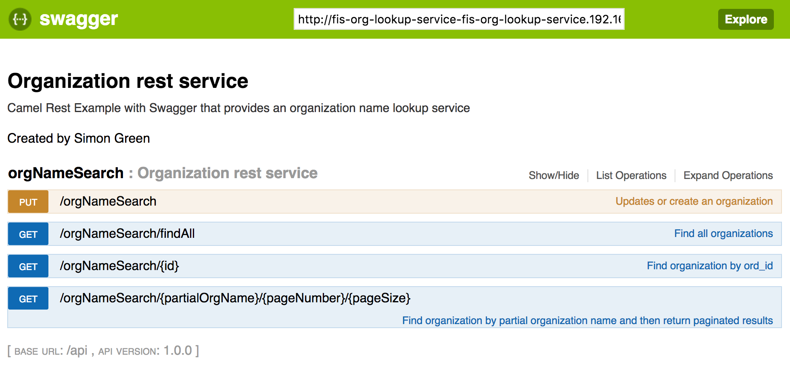

Fuse Integration Services (FIS) RestDSL wrapper around an RDS datasource
====================================

Demonstration of a RestDSL wrapper with Swagger Docs around an Amazon EC2 RDS datasource using the Fuse Integration Services SpringBoot image.  

## Overview

This project demonstrates a Restful wrapper around a relational database.  Using an in-memory Apache Derby relational database as the datasource, the usecase can easily be updated to connect to any relational database (see the commented bean hooks for Oracle in the camel-context.xml).  Additionally, the REST API is documented using Swagger.  The project makes use of camel-servlet component listening on port 8080 and configured using Spring Boot.

## Prerequisites

The project can run either as a standalone Java process or in a cloud environment.  An OpenShift environment must be present for deployment to to a cloud environment.  For the purpose of testing, I prefer to use [Minishift](https://fabric8.io/guide/getStarted/minishift.html)

The following are required to run this project:

1. JDK 1.8 or newer
2. Maven 3.3 or newer

### Building


1. Update the `support\sample-settings.xml` file with your local maven respository path (located on line 3)

## Deployment

This project can be deployed using two methods:

* Standalone Spring-Boot container
* On an Openshift environment using Fuse Integration Services 2.0

## Standalone Spring Boot Container

The standalone method takes advantage of the [Camel Spring Boot Plugin](http://camel.apache.org/spring-boot.html) to build and run the microservice.

Execute the following command from the root project directory:

```
mvn -s support/sample-settings.xml spring-boot:run -Dspring.profiles.active=dev
```

Once the spring boot service has started, you can test the REST API by executing the following command

```
curl http://localhost:8080/api/orgNameSearch/findAll
```

A complete list of Banks with corresponding ORG_ID is returned in JSON format.  You can also retrieve individual banks by specifying the corresponding ORG_ID:

```
curl http://localhost:8080/api/orgNameSearch/123
```

Additionally, it's possible to view paginated results using a partial organization name.  A good example of this would be:

```
curl http://localhost:8080/api/orgNameSearch/Bank/1/5
```

where "Bank" is the partial search word, "1" is the page number and "5" is the number of results per page.

Lastly, it's possible to add a new organization to database using the following command:

```
curl -X PUT --header 'Content-Type: application/json' --header 'Accept: application/json' -d '{ "org_id": 888, "org_name": "Bank of Simon" }' 'http://localhost:8080/api/orgNameSearch'
 ```

It's also possible to navigate the REST service using the Swagger documentation [here](http://localhost:8080/index.html).

## Openshift / Minishift Deployment

First, create a new OpenShift project called *fis-org-lookup-service*

```
oc new-project fis-org-lookup-service --description="Fuse Integration Services Datasource Rest Wrapper Demo" --display-name="Datasource Rest Wrapper"
```

Execute the following command which will execute the *ocp* profile that executes the `clean fabric8:deploy` maven goal:

```
mvn -s support/sample-settings.xml -P ocp
```

The fabric8 maven plugin will perform the following actions:

* Compiles and packages the Java artifact
* Creates the OpenShift API objects
* Starts a Source to Image (S2I) binary build using the previously packaged artifact
* Deploys the application using binary streams

## Swagger UI

A [Swagger User Interface](http://swagger.io/swagger-ui/) is available within the fis-org-lookup-service application to view and invoke the available services. 

Select the hyperlink for the gateway application to launch the Swagger UI



The raw swagger definition can also be found at the context path `api/api-doc` 

## Command Line Testing

Using a command line, execute the following to query the definition service

```
curl -s http://$(oc get routes fis-org-lookup-service --template='{{ .spec.host }}')/api/orgNameSearch/Bank/1/5 | python -m json.tool
```
	
A successful response will output the following

```
[
    {
        "ORG_ID": 7,
        "ORG_NAME": "Bank of New York Mellon New York NY"
    },
    {
        "ORG_ID": 9,
        "ORG_NAME": "SunTrust Bank Atlanta GA"
    },
    {
        "ORG_ID": 13,
        "ORG_NAME": "Toronto-Dominion Bank Toronto ON"
    },
    {
        "ORG_ID": 14,
        "ORG_NAME": "Royal Bank of Scotland Edinburgh"
    },
    {
        "ORG_ID": 20,
        "ORG_NAME": "Bank of Montreal Toronto ON"
    }
]
```
